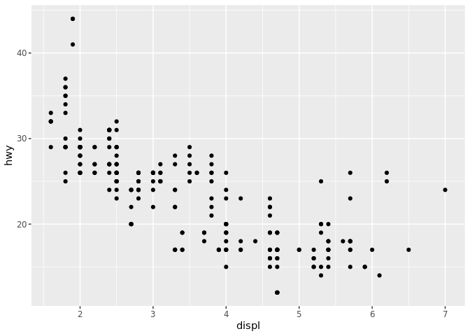
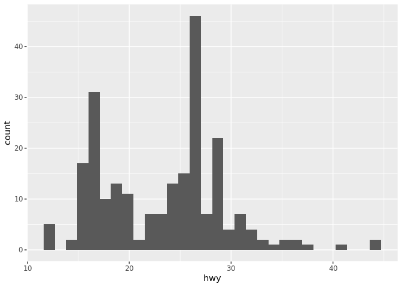
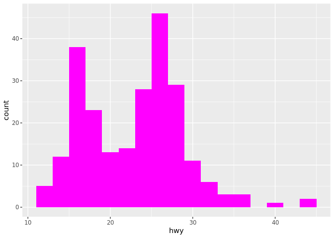
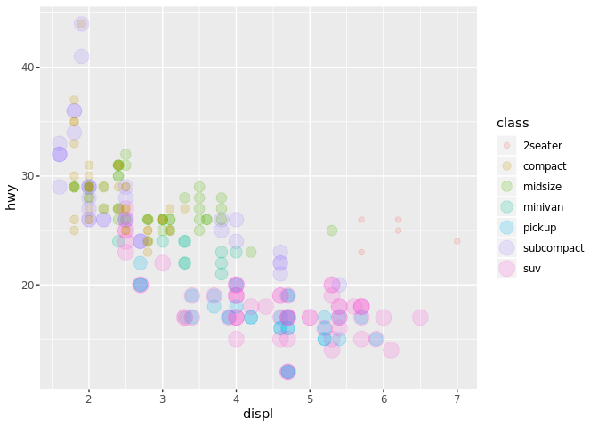
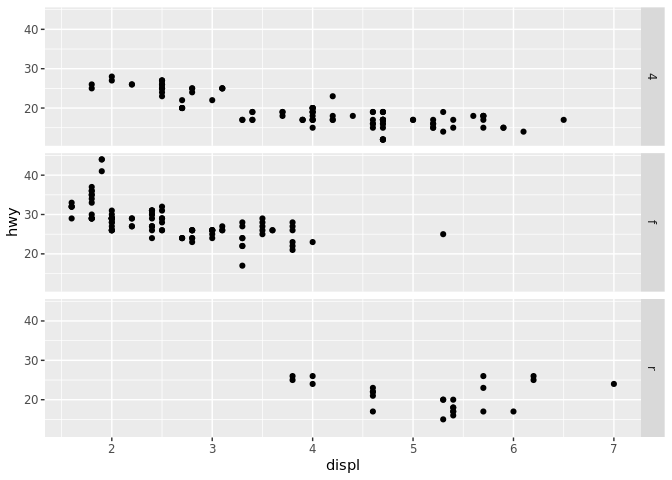
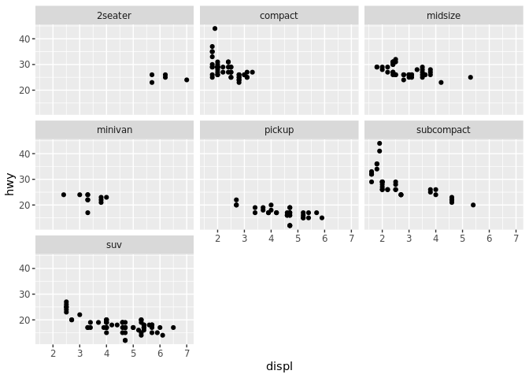

Visualize Data
================

``` r
data(mpg)
```

Your Turn 1
-----------

Run the code on the slide to make a graph. Pay strict attention to spelling, capitalization, and parentheses!

``` r
ggplot(data = mpg) +
  geom_point(mapping = aes(x = displ, y = hwy))
```



Your Turn 2
-----------

Replace this scatterplot with one that draws boxplots. Use the cheatsheet. Try your best guess.

``` r
ggplot(data = mpg) +
  geom_boxplot(mapping = aes(x = class, y = hwy))
```


Your Turn 3
-----------

Make a histogram of the `hwy` variable from `mpg`. Hint: do not supply a y variable.

``` r
ggplot(data=mpg) + 
  geom_histogram(aes(x=hwy))
```

    `stat_bin()` using `bins = 30`. Pick better value with `binwidth`.



Your Turn 4
-----------

Use the help page for `geom_histogram` to make the bins 2 units wide.

``` r
ggplot(data=mpg) + 
  geom_histogram(aes(x=hwy),binwidth = 2, fill="magenta")
```



Your Turn 5
-----------

Add `color`, `size`, `alpha`, and `shape` aesthetics to your graph. Experiment.

``` r
ggplot(data = mpg) +
  geom_point(mapping = aes(x = displ, y = hwy, color=class))
```


``` r
ggplot(data = mpg) +
  geom_point(mapping = aes(x = displ, y = hwy, color=class, size=class), alpha=0.2)
```

    Warning: Using size for a discrete variable is not advised.



Help Me
-------

What do `facet_grid()` and `facet_wrap()` do? (run the code, interpret, convince your group)

``` r
# Makes a plot that the commands below will modify
q <- ggplot(mpg) + geom_point(aes(x = displ, y = hwy))

q + facet_grid(. ~ cyl)
```


``` r
q + facet_grid(drv ~ .)
```



``` r
q + facet_grid(drv ~ cyl)
```


``` r
q + facet_wrap(~ class)
```



Your Turn 6
-----------

Make a bar chart `class` colored by `class`. Use the help page for `geom_bar` to choose a "color" aesthetic for class.

Quiz
----

What will this code do?

``` r
ggplot(mpg) + 
  geom_point(aes(displ, hwy)) +
  geom_smooth(aes(displ, hwy))
```

    `geom_smooth()` using method = 'loess' and formula 'y ~ x'


------------------------------------------------------------------------

Take aways
==========

You can use this code template to make thousands of graphs with **ggplot2**.

``` r
ggplot(data = <DATA>) +
  <GEOM_FUNCTION>(mapping = aes(<MAPPINGS>))
```
